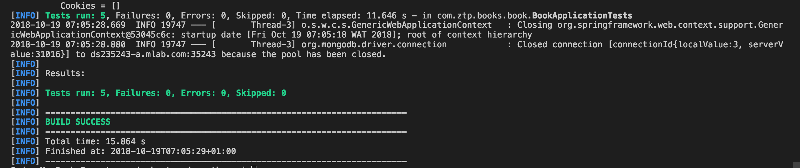

# Java Spring Boot REST API

A Restful CRUD API for a simple Book Management Application using Spring Boot, MongoDB, JPA, Junit and MockMVC

## Table of Contents

- [Requirements](#requirements)
- [Setup](#setup)
- [Routes](#routes)
- [Tests](#tests)


Requirements
-------------
- Java 1.8.x
- MongoDB
- Maven 3.x.x

## Setup

## Steps to Setup

**1. Clone the application**

```bash
git clone https://github.com/ahmedolaibrahim/ztp-springboot.git
```

**2. Create MongoDB database**
```bash
 use ztp_bootspring
```

**3. Change mongoDb access credentials to suit your mongo deployment**

+ open `src/main/resources/application.properties`

+ change `spring.data.mongodb.host`,`spring.data.mongodb.port`, `spring.data.mongodb.username`, `spring.data.mongodb.password` and ``spring.data.mongodb.database`  as per your mongodb deployment

**4. Build and run the app using maven**

```bash
mvn package
java -jar target/ztp-books-1.0.0.jar
```

Alternatively, you can run the app without packaging it using -

```bash
mvn spring-boot:run
```
The app will start running at <http://localhost:8080>.

**5. Running Tests**

```bash
mvn test
```

if tests runs successfully you should have 



## Routes

The app defines following routes.

   - GET /api/books
    
   - POST /api/books
    
   - GET /api/books/{bookId}
    
   - PUT /api/books/{bookId}
    
   - DELETE /api/books/{bookId}

